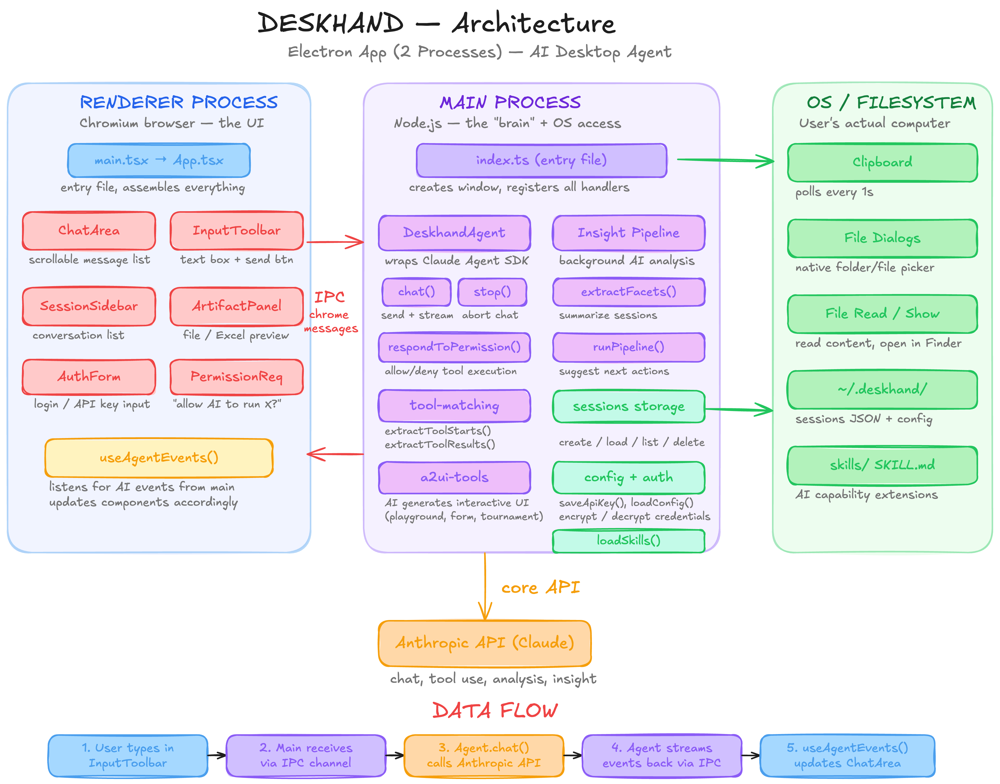

1. 效果展示
2. 安装 MCP 与 Skills
3. 启动 Excalidraw 服务
4. 开始作图
---
## 1. 效果展示

我用它为自己的桌面智能体绘制了一张架构图：



## 2. 安装 MCP 与 Skills

让 Claude Code 帮你安装：

```
1. 这是项目地址：https://github.com/yctimlin/mcp_excalidraw
2. 探查项目，了解它如何协助 Claude Code 绘制 Excalidraw
3. 安装相关的 MCP 和 Skills
4. 完成后告诉我如何使用（比如启动 MCP 的前置要求）
```

## 3. 启动 Excalidraw 服务

让 Claude Code 帮忙启动服务：

```
这个 MCP 已安装完成，请帮我启动服务器，通常需要：

# 设置环境变量
export EXPRESS_SERVER_URL=http://localhost:3000

# 运行 canvas 服务器
npx @excalidraw/excalidraw-canvas-server
```

## 4. 开始作图

有两种方式：

**方式一：直接沟通**

```
/excalidraw-skill
帮我探查这个项目，并将项目结构用这个 skill 画出来
```

**方式二：使用 project-anatomy skill（推荐）**

安装 skill：
```
https://github.com/YUHAO-corn/corn-awesome-skills/tree/main/project-anatomy
```

新开终端启动 Claude Code 使 skill 生效，然后：

```
/project-anatomy
```

就会自动完成：项目拆解 → 服务器启动 → 生成架构图